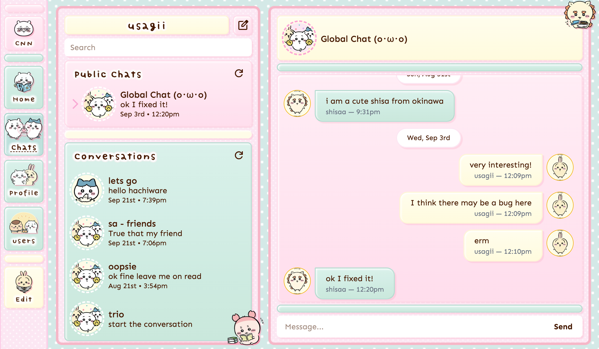
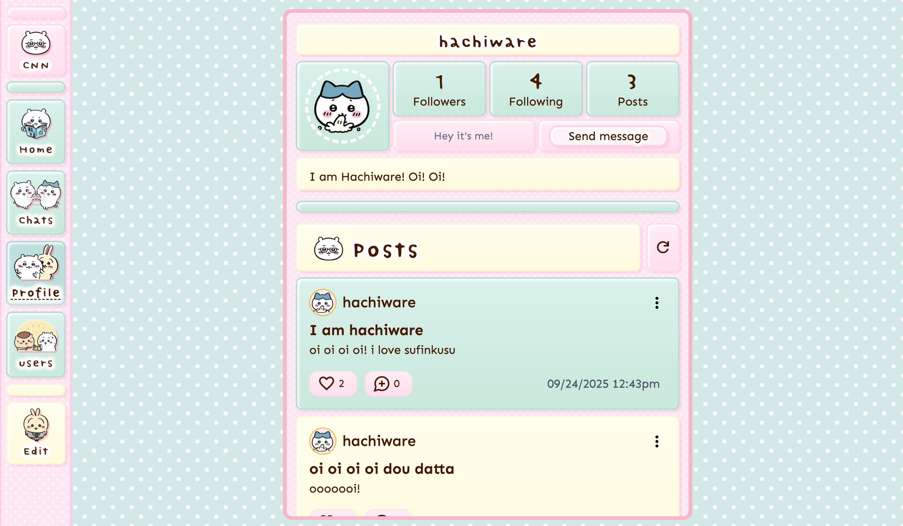
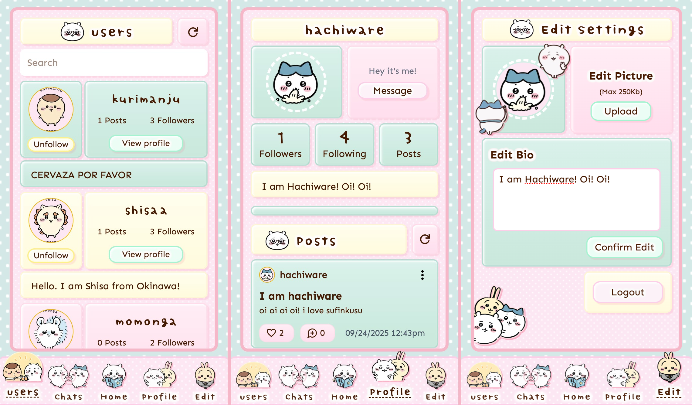

<h1 align="center">Chiikawa News Network</h1>
<h3 align="center">A social network by and for Chiikawa enjoyers! <br/> Click <a href='https://chiikawa-news-network.netlify.app' target="_blank">here</a> to start connecting today</h3>
<p align="center">
    
</p>

### Features

- Realtime messaging with sockets (messages stored on server)
- Create / delete / like / unlike posts (title, content, media)
    - Post media types: Giphy links, upload files (stored on Supabase), & external media links
    - Create / delete / like / unlike post comments
- Private, Group, & Public chats
- Create, rename, delete private & group chats
- User signup / login / following / unfollowing / create & edit bio / create & edit profile picture (stored on Supabase)
- Desktop, Tablet, & mobile design
- Text obscenity filter (for da kids)

## App Showcase

| Chat                                         |
| -------------------------------------------- |
|  |

| Profile                                         |
| ----------------------------------------------- |
|  |

| Mobile                                         |
| ---------------------------------------------- |
|  |

## Endpoints & Socket Events

| Method | URI                        | Function                    | Token | Body                                | Notes                               |
| ------ | -------------------------- | --------------------------- | ----- | ----------------------------------- | ----------------------------------- |
| POST   | /signup                    | Create user                 | N     | { username, password}               |                                     |
| POST   | /login                     | Login user                  | N     | { username, password}               |                                     |
| POST   | /guest-login               | Login guest user            | N     |                                     |                                     |
| GET    | /current                   | Retrieve current user       | Y     |                                     |                                     |
| PATCH  | /current/bio               | Update bio                  | Y     | { bio }                             |                                     |
| PATCH  | /current/avatar            | Update avatar               | Y     | { avatar }                          | max 250kb upload                    |
| GET    | /users                     | Retrieve all users          | Y     |                                     |                                     |
| GET    | /users/:userId             | Retrieve user data          | Y     |                                     |                                     |
| GET    | /users/:userId/posts       | Retrieve posts by user      | Y     |                                     | query: limit, cursor                |
| GET    | /users/:userId/followers   | Retrieve followers by user  | Y     |                                     |                                     |
| POST   | /users/:userId/following   | Follow :userId              | Y     |                                     |                                     |
| DELETE | /users/:userId/following   | Unfollow :userId            | Y     |                                     |                                     |
| GET    | /users/:userId/following   | Retrieve following by user  | Y     |                                     |                                     |
| GET    | /chats-public              | Retrieve public chats       | Y     |                                     |                                     |
| GET    | /chats                     | Retrieve chats              | Y     |                                     |                                     |
| POST   | /chats                     | Create chat                 | Y     | { name, userIds: ['id_1', 'id_2'] } |                                     |
| GET    | /chats/:chatId             | Retrieve chat               | Y     |                                     |                                     |
| PATCH  | /chats/:chatId             | Update chat name            | Y     | { name }                            | name optional                       |
| DELETE | /chats/:chatId             | Delete chat                 | Y     |                                     |                                     |
| GET    | /posts                     | Retrieve all posts          | Y     |                                     | query: userId, limit, cursor        |
| GET    | /posts/feed                | Retrieve posts by following | Y     |                                     | query: limit, cursor                |
| POST   | /posts                     | Create post                 | Y     | { title, content, media }           | max 250kb upload, accepts media URL |
| DELETE | /posts/:postId             | Delete post                 | Y     |                                     |                                     |
| POST   | /posts/:postId/likes       | Like post                   | Y     |                                     |                                     |
| DELETE | /posts/:postId/likes       | Unlike post                 | Y     |                                     |                                     |
| GET    | /posts/:postId/comments    | Retrieve comments           | Y     |                                     |                                     |
| POST   | /posts/:postId/comments    | Create comment              | Y     | { content }                         |                                     |
| DELETE | /comments/:commentId       | Delete comment              | Y     |                                     |                                     |
| POST   | /comments/:commentId/likes | Like comment                | Y     |                                     |                                     |
| DELETE | /comments/:commentId/likes | Unlike comment              | Y     |                                     |                                     |

| Socket Event      | Arguments      | Use                              |
| ----------------- | -------------- | -------------------------------- |
| 'connection'      | token          | socket connection                |
| 'send_message'    | token, message | sending messages                 |
| 'receive_message' | message        | notify client to update messages |
| 'join_room'       | token, chatId  | join chat                        |
| 'disconnecting'   |                | leave rooms before disconnect    |
| 'disconnect'      |                | log id has disconnected          |

### Frontend Stack

| Technology                                                 | Use                                                                      |
| ---------------------------------------------------------- | ------------------------------------------------------------------------ |
| React + Vite                                               |                                                                          |
| Tailwind                                                   | CSS                                                                      |
| React Router                                               | Routing                                                                  |
| Giphy                                                      | Fetching gif links                                                       |
| Motion                                                     | Animations                                                               |
| Simplebar                                                  | Consistent scrolling between input types (mobile, touchpad, mouse & key) |
| Socket.io Client                                           | Real-time communication                                                  |
| uuid                                                       | creating uuids                                                           |
| obscenity                                                  | Text censoring                                                           |
| date-fns                                                   | date formatting                                                          |
| <a href='https://netlify.com/' target="_blank">Netlify</a> | Client hosting                                                           |

### Backend Stack

| Technology                                                 | Use                            |
| ---------------------------------------------------------- | ------------------------------ |
| Node + Express                                             | Rest API                       |
| Prisma ORM + PostgreSQL                                    | database                       |
| Socket.io                                                  | Realtime messaging             |
| Supabase                                                   | Storing avatars & post images  |
| Multer                                                     | File upload                    |
| Sharp                                                      | Image compressing / processing |
| Express Validator                                          | Endpoint input validation      |
| JSON webtoken + bcryptjs                                   | authentication + authorization |
| <a href='https://app.koyeb.com/' target="_blank">Koyeb</a> | Server hosting                 |
| <a href='https://neon.com/' target="_blank">Neon</a>       | Database hosting               |
| obscenity                                                  | Text censoring                 |
| cors                                                       | server origin enforcement      |
| dotenv                                                     | environment variables          |

## Learning Outcomes

- Interaction
    - Testing on an actual mobile device! (broadcasting server & client through my WiFi signal)

- Backend
    - Open connections with sockets for realtime messaging
    - Pagination: Implement cursor based pagination for retrieving posts
    - Prisma CASE Statement: Prisma doesn't support CASE statement so I jerry rigged one to implement a hasLiked field for posts
    - Storing files (post media, profile pictures) remotely on supabase
    - Running scripts on server startup (seeding public chats, guest account)
    - CORS limiting which clients can make server requests

- Frontend
    - Executing code on scrolling to bottom on component
    - Learning sentinel pattern with IntersectionObserver API for infinite scrolling
    - Revisiting how stacking contexts work
    - Implementing API handler to handle boilerplate isLoading and error catching on API request
    - Implementing elegant responsive designs (layouts that shift on screen breakpoints vs mobile -> render this, desktop -> render that)

### Retrospective aka yapping

This project solidifies my decision to become a web developer. This site design went through 5+ iterations before I settled on a theme. This was truly a labor of love. I am really really proud of my site styling and of the UserInfo grid styling (Desktop/Mobile same components but changing grid values). On the server, I'm really glad I got real-time messaging and pagination to work as well. I hope fellow chiikawa enjoyers can appreciate it as well.

## Start commands

```bash
# Start backend server
cd server
npm install
node --watch server.js
```

```bash
# Start frontend react
cd client
npm install
npm run dev

# OR
cd client
npm install
npm run build
npm run preview
```

## Environment variables

#### ./server/.env

```bash
PORT
SERVER_URI
CLIENT_URI

# Database
DATABASE_URL
TOKEN_SECRET

# Socket Debug
SOCKET_ADMIN_USERNAME
SOCKET_ADMIN_PASSWORD

# Supabase
SUPABASE_URL
SUPABASE_KEY
SUPABASE_DEFAULT_CHAT_AVATAR
SUPABASE_DEFAULT_GROUP_CHAT_AVATAR

# Guest Credentials
GUEST_USERNAME
GUEST_PASSWORD
```

#### ./client/.env

```bash
VITE_SERVER_URI
VITE_GIPHY_API_KEY
```

## Acknowledgements

| Usage               | Source                                                                          |
| ------------------- | ------------------------------------------------------------------------------- |
| Images              | Chiikawa - Nagano                                                               |
| Icons               | Google material icons                                                           |
| Specs               | [The Odin Project](https://www.theodinproject.com/lessons/nodejs-messaging-app) |
| Styling Inspiration | https://nyaa.neocities.org/shrines/chiikawa                                     |

## Added extras

- client
    - path aliasing

## Known Issues

- Post retrieval sometimes returns posts in incorrect order (I suspect an issue with the pagination implementation)
- Fetching posts infinitely on prod... Something wrong with implementation of fetching posts
    - possibly refetching while loading

## Potential Improvements

- make loading not gray (its ugly)
- reconfigure modal to close w/o close function
- document client routes!

## NOTES

- feature folder architecture
    - app -> for composition
    - features -> logic
    - shared -> primitives
    - features can depend on other features
